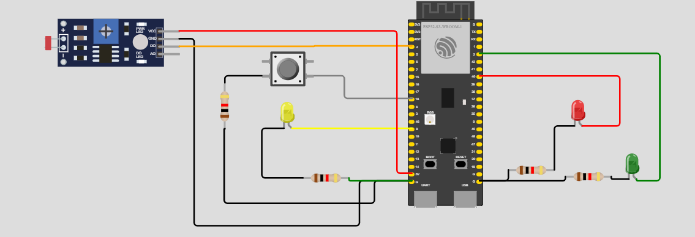
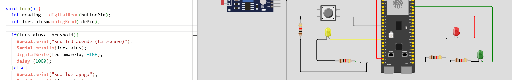
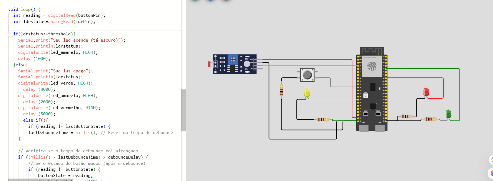
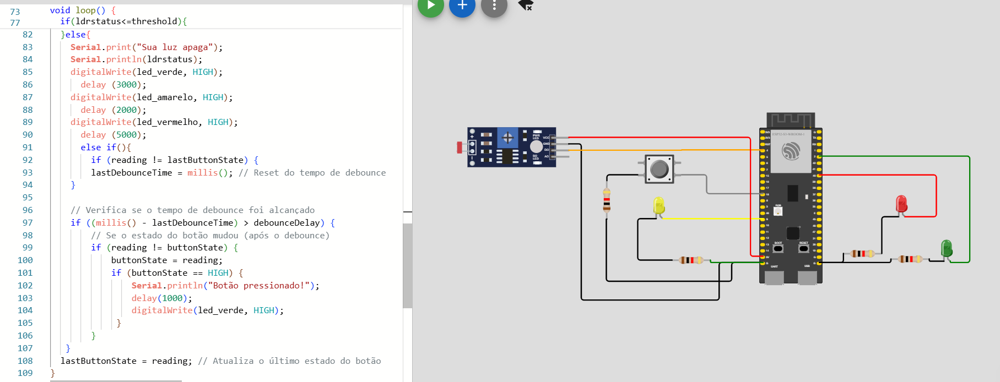

Etapa 1: O código foi padronizado para português
Etapa 2 (Todas as entradas e saídas devem estar declaradas corretamente na inicialização) e 3 (Todos os leds devem estar apagados na inicialização):

Etapa 4 (Quando estiver escuro (segundo a leitura analógica do sensor LDR), o protótipo deve ativar o modo noturno e piscar o led amarelo a cada segundo) nesse momento o wokwi não tava funcionando:

Etapa 5 Quando estiver claro (segundo a leitura analógica do sensor LDR), o protótipo deve ativar o modo convencional e fazer a temporização alternando entre verde (3 segundos), amarelo (2 segundos) e vermelho (5 segundos)  

Etapa 6(Quando estiver claro (segundo a leitura analógica do sensor LDR) e o semáforo estiver no estado fechado (somente led vermelho aceso) e o botão for pressionado, o semáforo deve abrir 1 segundo após o pressionamento do botão) e 7(O protótipo deve suportar debounce na leitura do botão):
